# 🐧 Void Linux do Zero

Um guia completo e amigável para iniciantes sobre como instalar, configurar e dominar o **Void Linux** — do zero até um sistema totalmente personalizado.  
Este projeto foi criado para documentar minha jornada pessoal configurando o Void Linux e ajudar outras pessoas que queiram explorar essa incrível distribuição *rolling release*.

---

## 📖 Índice
- [Sobre este projeto](#-sobre-este-projeto)
- [Por que Void Linux?](#-por-que-void-linux)
- [Requisitos do sistema](#-requisitos-do-sistema)
- [Instalação](#-instalação)
- [Pós-instalação](#-pós-instalação)
- [Drivers e Hardware](#-drivers-e-hardware)
- [Ambientes gráficos](#-ambientes-gráficos)
- [Ferramentas essenciais](#-ferramentas-essenciais)
- [Dicas e truques](#-dicas-e-truques)
- [Solução de problemas](#-solução-de-problemas)
- [Contribuindo](#-contribuindo)
- [Licença](#-licença)

---

## 🧠 Sobre este projeto
Este repositório serve como um **tutorial passo a passo** para instalar e configurar o Void Linux — incluindo rede, drivers, ambientes gráficos e ferramentas de desenvolvimento.  
Todas as explicações são escritas de forma **clara e direta**, para que qualquer pessoa consiga acompanhar com facilidade.

> 📝 Estou documentando tudo o que faço — desde o primeiro boot até as personalizações avançadas.

---

## 💡 Por que Void Linux?
O Void Linux é uma distribuição leve e independente, conhecida por seu:
- 🧩 **RunIt**, sistema de inicialização rápido e simples  
- ⚡ Modelo **rolling release**  
- 🧘 **Minimalismo e controle total**  
- 💻 **Desempenho e estabilidade**

Se você quer aprender como o Linux realmente funciona por dentro, o Void Linux é uma excelente escolha.  
Este projeto também serve para mostrar o **potencial do i3wm** — um *tiling window manager* minimalista, rápido e poderoso, que transforma a forma como você interage com seu sistema.

### 🆚 Void Linux vs Arch Linux

- O Void é **totalmente independente**, enquanto o Arch depende do ecossistema GNU e do systemd.  
- O **RunIt** do Void é mais simples e leve que o **systemd** do Arch.  
- O Void usa o **xbps**, seu próprio gerenciador de pacotes — rápido e limpo.  
- Por ser mais enxuto, o Void costuma ter **boot e uso de memória mais leves**.  
- O Arch tem mais suporte e comunidade maior, mas o Void oferece **mais controle e menos sobrecarga**.  

💬 **Em resumo:** o **Arch é para aprender Linux**, o **Void é para entender o Linux.**


---

## ⚙️ Requisitos do sistema
| Componente | Mínimo | Recomendado |
|-------------|--------|--------------|
| CPU | Processador 64-bit | Dual-core ou superior |
| RAM | 1 GB | 4 GB+ |
| Armazenamento | 5 GB | 20 GB+ |
| Internet | Opcional | Recomendado para instalar pacotes |

---

## 🧩 Instalação

Nesta seção, você aprenderá a preparar e instalar o **Void Linux** passo a passo — desde o download da ISO até o boot inicial do sistema.

---

### 🖥️ 1. Download da ISO

Você pode baixar a imagem do Void Linux de duas formas:

- 🌐 **Site oficial:** [voidlinux.org/download](https://voidlinux.org/download/)

> ⚙️ Para este guia, utilize a **Live Image base** do Void Linux — ela vem minimalista e é perfeita para aprender cada etapa da configuração.

---

### 💾 2. Criação do Pendrive Bootável

Para criar o pendrive bootável, você pode usar qualquer ferramenta de sua preferência.  
Pessoalmente, eu recomendo o **Ventoy**, pois ele permite adicionar várias ISOs no mesmo pendrive de forma simples.

🔗 **Tutorial em vídeo (YouTube):**  
[Como criar um pendrive bootável com Ventoy](https://youtu.be/11CkqZQ3scE?si=4x_zx6tQhr5wKBks)

> 💡 Existem diversos tutoriais no YouTube sobre o processo — então não vou me estender muito nesta parte.

---

### 🚀 3. Bootando o Pendrive e Iniciando a Instalação do Void Linux

✨ Próximo passo: iniciar o instalador do Void Linux a partir do pendrive bootável.

🧠 Passos:

Reinicie o computador e acesse a BIOS/UEFI.

Geralmente, as teclas usadas são Del ou F2 (você pode tentar ambas).

Altere a ordem de boot para que o pendrive seja o primeiro da lista.

Salve e saia da BIOS.
Seu sistema agora iniciará com a tela do Ventoy, como o exemplo abaixo:

<p align="center">  </p> <p align="center"><i>💡 Imagem ilustrativa — sua tela pode variar levemente.</i></p>

Após o Ventoy carregar, selecione a ISO do Void Linux e, em seguida, escolha a opção mostrada na imagem abaixo:

<p align="center">  </p> <p align="center"><i>🧩 Menu secundário do Ventoy — selecione para iniciar a instalação.</i></p>

---
### 🚀 4. Início da Instalação do Void Linux

Após passar pelos menus anteriores, você verá o seguinte menu:  
Basta selecionar a **mesma opção** mostrada na imagem abaixo 👇

<p align="center">
  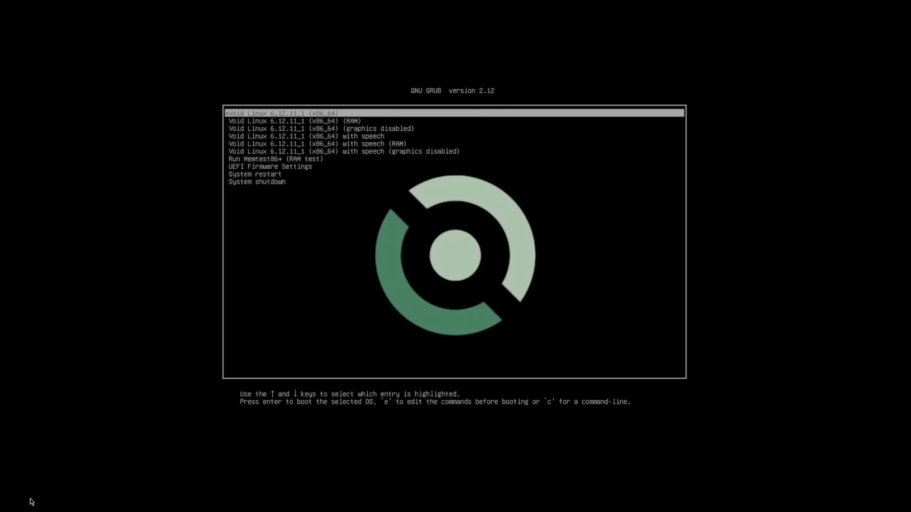
</p>

---
ㅤ
ㅤ
### 🧑‍💻 Login do sistema live**

Feito isso, ele irá pedir o login do **void-live**.  
As credenciais são as seguintes:

```
Login: root
Senha: voidlinux
```

---

✅ E pronto!  
A imagem ISO já estará ativa e você poderá começar a instalação do seu Void Linux. 🐧

---
ㅤ
ㅤ
### 🌐 Conexão com a internet

É de suma importância ter conexão à internet.  
Se possível, utilize **rede cabeada**, pois é mais rápida e estável.  
Caso não tenha, siga os passos abaixo para conectar via Wi-Fi:

1️⃣ **🧠 Entrar no modo interativo do iwctl**
```bash
iwctl
```
>Vai aparecer algo tipo:

```
[iwd]#
```
2️⃣ **📶 Ver as interfaces disponíveis**

>Dentro do iwctl, digita:

```
[iwd]# device list
```

Procura algo como wlan0 ou wlp2s0.
Esse é o nome da tua placa Wi-Fi

3️⃣ **🔍 Ver redes disponíveis**

>Ainda dentro do iwctl:

```
[iwd]# station wlan0 scan
[iwd]# station wlan0 get-networks
```
>(substitui wlan0 pelo nome real do teu dispositivo)

4️⃣ **🔑 Conectar à rede**

```
[iwd]# station wlan0 connect NOME_DA_REDE
```
Se tiver senha, ele vai pedir pra digitar.

>Exemplo:

```
[iwd]# station wlan0 connect MinhaRedeWiFi
```


5️⃣ **🌐 Testar a conexão**

Sai do iwctl com:

```
[iwd]# exit
```
Depois testa com:

```
# ping voidlinux.org
```

ele apresentara um retorno assim:

```
>PING voidlinux.org (159.69.226.196) 56(84) bytes of data.
>64 bytes from 159.69.226.196: icmp_seq=1 ttl=51 time=23.4 ms
>64 bytes from 159.69.226.196: icmp_seq=2 ttl=51 time=22.8 ms
>64 bytes from 159.69.226.196: icmp_seq=3 ttl=51 time=23.1 ms
```

feito isso, tudo certo : ) vamos para a proxima etapa
ㅤ
ㅤ

---
ㅤ
ㅤ
## Instalação

>Você pode utilizar o instalador automatizado do void, mas particularmente eu nao gosto muito, e recomendo você fazer a instalação via chroot que é como ajudarei a fazer neste tutorial

**💽 Montar Unidades**

>bom a primeira coisa que precisamos fazer, é particionar o nosso disco, eu particularmente gosto muito de utilizar o cfdisk, então nesse tutorial irei utilizar ele, para isso você precisará digitar:

```
# lsblk
```

>Você verá algo do tipo:

<p align="center">
  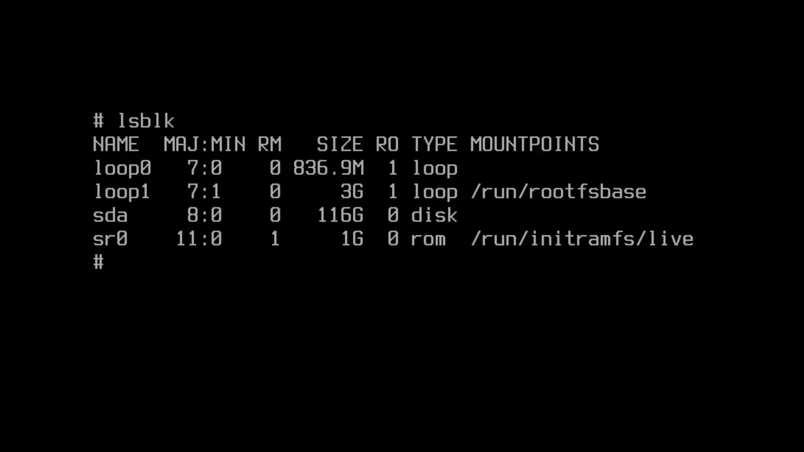
  <br>
  <i>Imagem ilustrativa — você verá listado o seu SSD ou HD real.</i>
</p>


>Agora você irá digitar:

```
# cfdisk /dev/sda
```

>Você deverá substituir esse sda pelo nome do seu disco, se fosse um ssd nvme, iria listar como: 'nvme1n1' algo do tipo...

>Após isso voce vera um menu como esse:

<p align="center">
  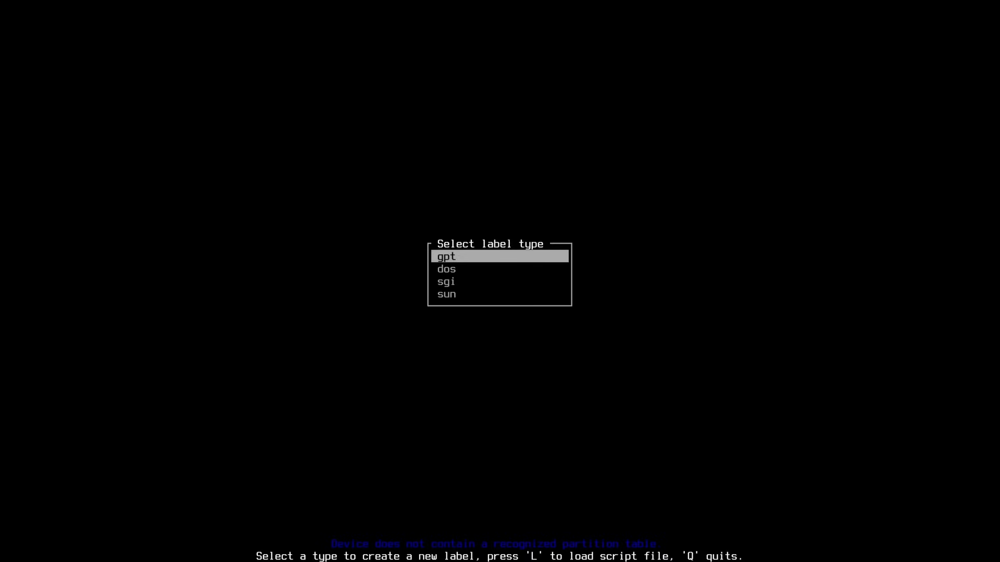
</p>

>Como estamos em um sistema UEFI usaremos o sistema gpt msm

>feito isso você verá a seguinte tela:

<p align="center">
  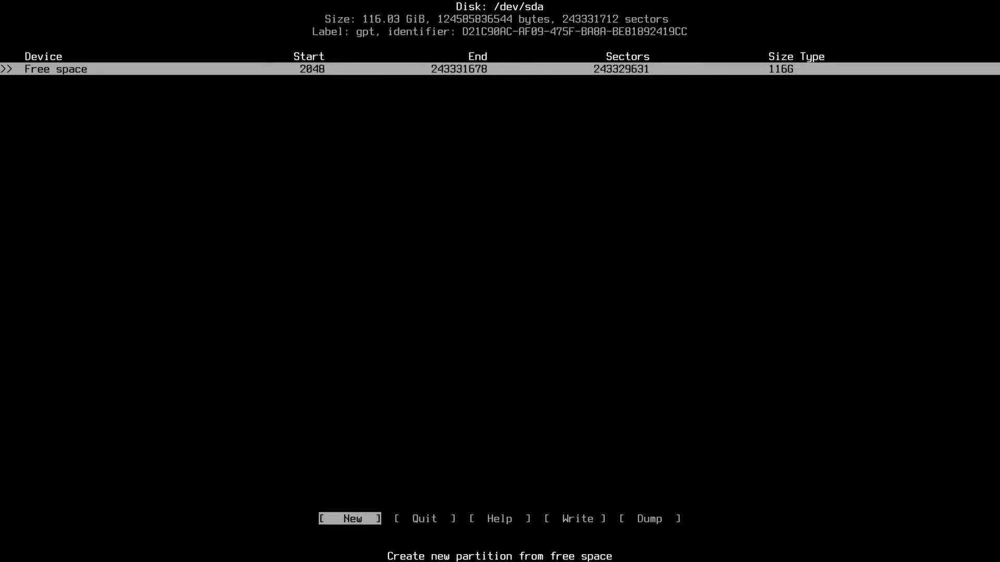
</p>

>Dai você clica 'ENTER', e ele ira perguntar o tamanho da partição dai você poe exatamente:

```
# 1G
```

>Esse '1G' é para partição de boot onde logicamente irá ter 1GB, depois de digitar 1G aperte 'ENTER'

>Novamente você irá até a sessão onde esta o espaço livre, e aperte 'ENTER', e ele ira perguntar o tamanho da partição dai você poe exatamente:

```
# 4G
```

>Esse '4G' é para uma partição SWAP, você não precisa fazer essa se nao quiser uma partição swap, mas particulamente sempre fiz, então vai da sua escolha.

>Novamente você irá até a sessão onde esta o espaço livre, e aperte 'ENTER' DUAS VEZES para utilizar o total do espaço restante para sua partição root, voce deverá obter algo parecido com isso:

<p align="center">
  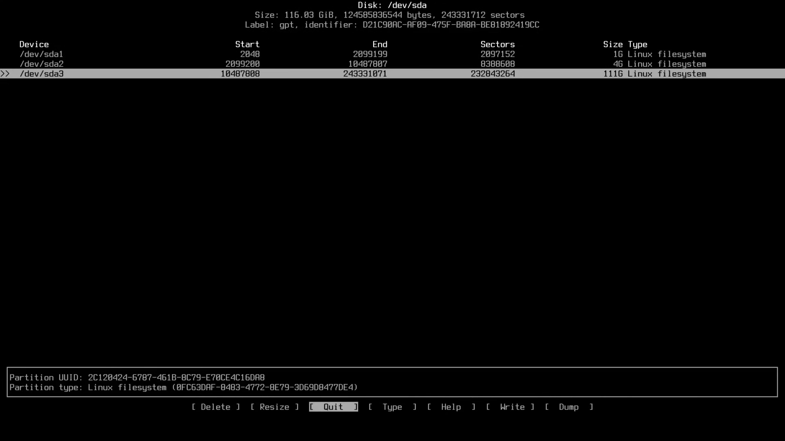
</p>

>Dai você navege até onde esta escrito 'Write' aperte enter, e obrigatoriamente você deverá escrever 'yes' dessa mesma forma, dai aperte 'ENTER', e depois pode sair indo até 'quit' e apertando 'ENTER'

>Após sair digite:

```
# lsblk
```

>Para confirmar tudo isso... você verá algo parecido com isso:

<p align="center">
  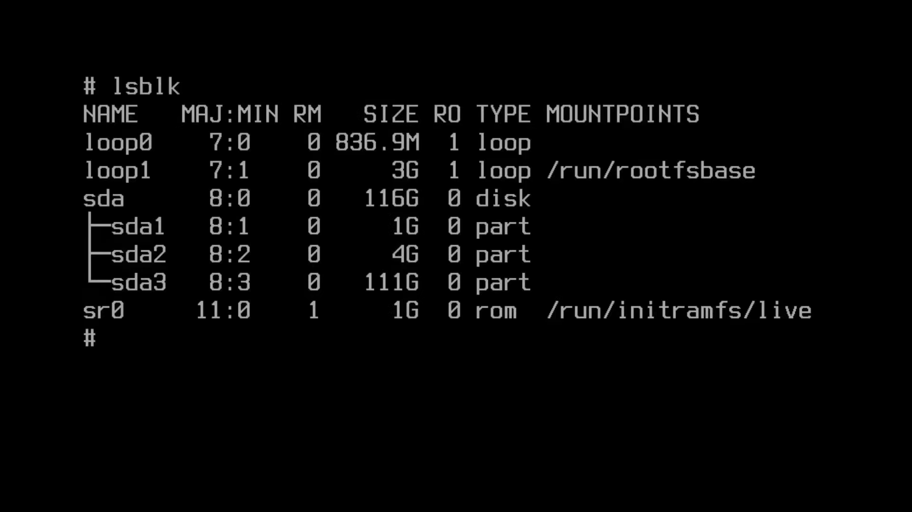
</p>

>Vamos prosseguir para criar esses sistemas de arquivos, digite os seguintes comandos:

```
# mkfs.ext4 /dev/sda3
```

>Pronto agora temos nosso sistema de arquivos root configurado

>⚠️ OBS: sempre trocando o 'sda' pelo nome do seu dispositivo

>E agora para nosso sistema de arquvios de inicialização, digite:

```
# mkfs.fat -F 32 /dev/sda1
```

>E para o nosso swap digite:

```
# mkswap /dev/sda2
```
>E pronto, vamos montar essas unidades agora

>Para nosso sistema raiz, faça:

```
# mount /dev/sda3 /mnt
```
>Para nossa partição de inicialização, faça:

```
# mount --mkdir /dev/sda1 /mnt/boot/efi
```

>Para nosso swap, faça:

```
# swapon /dev/sda2
```

>Vamos confirmar tudo isso novamente com:

```
# lsblk
```

>Você verá algo parecido com isso:

>Para confirmar tudo isso... você verá algo parecido com isso:

<p align="center">
  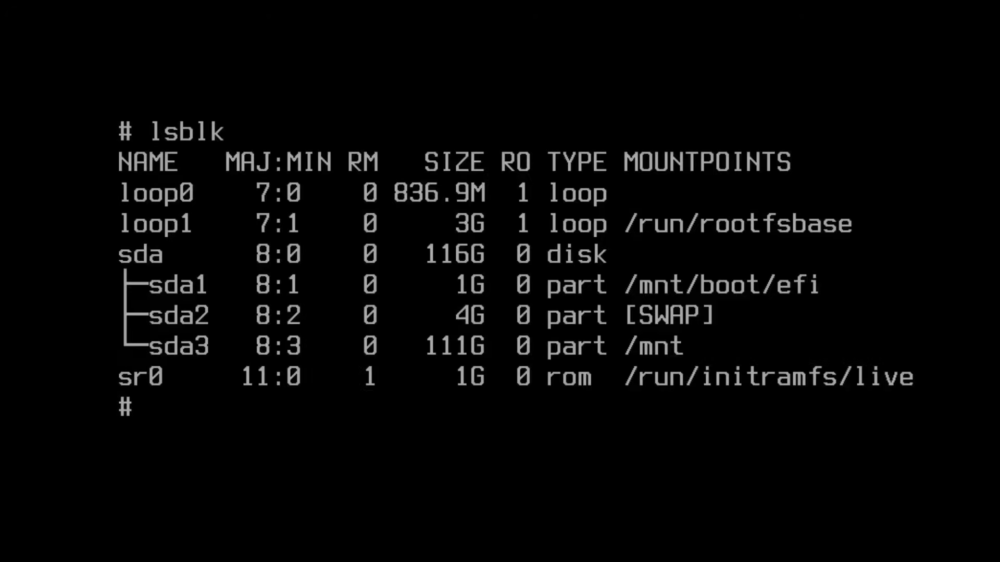
</p>

>Com isso temos nossa partição raiz, temos nossa partição de inicialização, e temos nosso swap, agora estamos prontos para instalar o void linux de fato.

**💻 Instalar o VoidLinux (literalmente)**

>O wiki de instalação ele recomenda instalar o sistema linux base diretamente no mnt logo após montar essas unidades, então iremos fazer isso e gerar a guia fs depois, então digite:

```
# xbps-install -Sy -R https://repo-default.voidlinux.org/current -r /mnt base-system
```
>Clique em sim

>Agora é hora de gerar a guia fs aqui, então digite:

```
# xgenfstab -U /mnt > /mnt/etc/fstab
```

>Logo após digite:

```
# xchroot /mnt /bin/bash
```

>⚙️ xbps é o gerenciador de pacotes do Void Linux, e você vai usá-lo bastante durante a instalação.
>🔄 A sintaxe dele é um pouco diferente se você vem do Arch Linux (pacman), mas não se preocupe — ele possui todas as ferramentas que você precisa.
📘 Recomendo dar uma olhada na documentação oficial para se familiarizar com os comandos:
👉 https://docs.voidlinux.org/xbps/index.html

>Vamos utilizar o xbps agora para instalar o vim, base-devel, grub pois eventualmente iremos precisar dele, e como estamos em uma maquina EFI então usaremos o efibootmgr:

```
[xchroot /mnt] # xbps-install base-devel vim grub efibootmgr
```

>Clique em sim

>A wiki recomenda editar o arquivo de nome do host e o local:

```
[xchroot /mnt] # vim /etc/hostname
```

>você irá ver 'void-live' escrito no vim, mude para o nome que você deseja, geralmente eu deixo 'voidlinux' mas por total preferencia minha... para salvar sua alteração, pressione a tecla 'ESC' e digite ':wq' para salvar e sair

>E para o nosso local precisaremos especificar isso então:

```
[xchroot /mnt] # vim /etc/default/libc-locales
```

>Este arquivo vai ser familiar se você ja instalou o ARCH

<p align="center">
  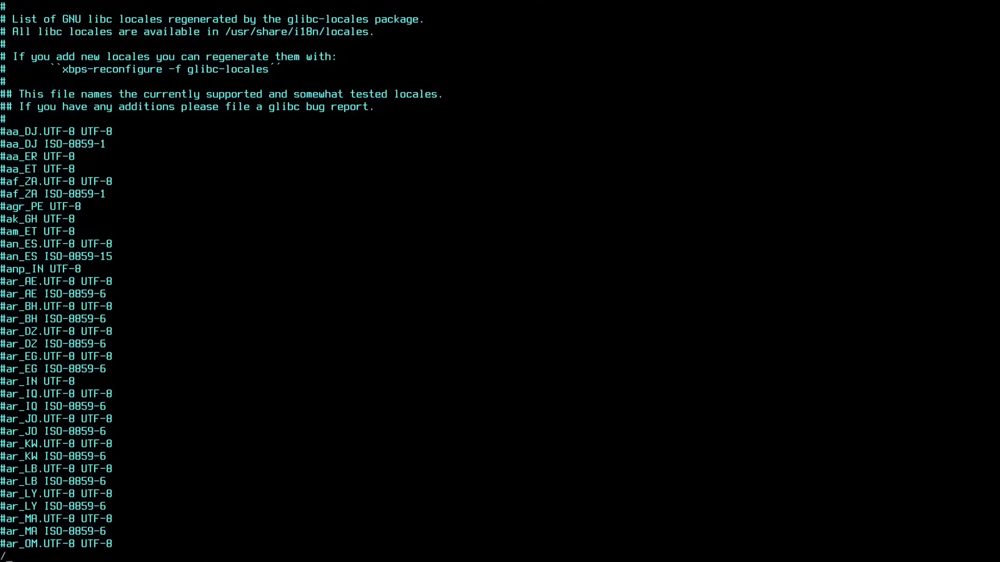
</p>

>digite '/' e procure pelo seu local, no meu caso 'pt-br.UTF-8', após achar o seu local, use a setas para até o começo da linha e delete o '#' da frente, e para salvar aperte 'ESC', e digite ':wq' para salvar e sair

>Agora vamos configurar usuários

```
[xchroot /mnt] # xbps-reconfigure -f glibc-locales
```

```
[xchroot /mnt] # passwd
```
>Ele vai pedir para você criar uma nova senha

```
[xchroot /mnt] # useradd -mG wheel ramon
```
>Substitua 'ramon' pelo nome de usuario que você deseja

```
[xchroot /mnt] # passwd ramon
```

>Ele vai pedir para você criar uma nova senha

```
[xchroot /mnt] # EDITOR=vim visudo
```

>nessa opção você pesquisa wheel com '/wheel'

<p align="center">
  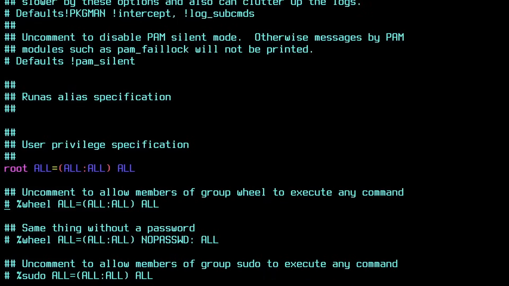
</p>

>você remove o # e o espaço onde esta o tracinho na foto, dai é so salvar novamente pressionando 'ESC' e digitando ':wq' para salvar e sair, e agora seu usuario deve ter pseudoprivilegios porque ele esta no grupo wheel

>Como estamos em um siste UEFI devemos instalar o grub

>digite:

```
[xchroot /mnt] # xbps-install -S grub-x86_64-efi
[xchroot /mnt] # grub-install --target=x86_64-efi --efi-directory=/boot/efi --bootloader-id="Void"
[xchroot /mnt] # grub-mkconfig -o /boot/grub/grub.cfg
```
>Pode ignorar o erro de desabilitação do OS, pois nao estamos utilizando inicialização dual

>Antes de reiniciar vamos instalar algumas coisas, para facilitar um pouco a vida na fase de instalações dos graficos

>Antes de mais nada, verifique se seu usuario tem pseudosprivilegios, digitando:

```
[xchroot /mnt] # su ramon
```

>⚠️ troque 'ramon' para o nome de usuario que você configurou anteriormente

```
[ramon@voidlinux] # ls
```

>esse comando vai fazer aparecer seus diretorios

```
[ramon@voidlinux] # sudo xbps-install -Su
```

>Ele vai pedir sua senha, e pronto 

**💻✨ Instalação dos Gráficos Xorg**

>O pacote xbps tem apenas 1 pacote xorg que cobre praticamente todos os casos

```
[ramon@voidlinux] # sudo xbps-install xorg xinit 
```
>Clique em sim

**🎨✨ Instalar o Gerenciador de Janelas**
>Como falei logo no começo antes de começarmos a instalação irei utilizar o 'I3WM' que é um gerenciador de janelas bem minimalista, porém você pode instalar outros gerenciadores, como gnome, kde, gwm, hyprland(so que o void nao da suporte oficial, posteriormente posso estar colocando neste tutorial como instalar com hyprland)

>Vamos começar:

```
[ramon@voidlinux] # sudo xbps-install i3 i3status alacritty firefox fastfetch
```

>Estamos quase prontos para finalmente reiniciar e desfrutar de um inicio, porém queremos ter certeza que nossa internet funciona após a reinicialização.

>O DHCPCD ele é uma solução minima para gerenciamento de rede, especialmente se voce esta utilizando uma conexão ethernet, entao eh ele que vamos utilizar hoje... então saia do seu usuário digitando:

```
[ramon@voidlinux] # exit
``` 

``` 
[xchroot /mnt] # xbps-install dhcpcd
``` 

>Geralmente ja está instalado nessa altura do campeonato

>Então tudo o que precisamos é configurar ele como um serviço para executa-lo 

>Então se você esta acostumado ao usar o systemd sabe que para configurar um serviço você digita algo como:

``` 
[xchroot /mnt] # systemctl enable service_name
```

>E estaria tudo certo, mas como o void eh runit, ao invés de ter algum comando de alias para criar o link para você, nos mesmos criamos o link (obs: claro que você pode configurar um alias para isso, mas qual a graça? hehe), então digite:

``` 
[xchroot /mnt] # ln -s /etc/sv/dhcpcd /etc/runit/runsvdir/default/dhcpcd
[xchroot /mnt] # ln -la /etc/runit/runsvdir/default
```

>Podemos ver que o tty está ativo e o dhcpcd já está vinculado. Configurar serviços com o runit é bem simples — e o melhor: você faz tudo manualmente, o que ajuda a criar bons hábitos e entender de fato como o sistema funciona.

>Acho que estamos quase prontos para reiniciar, vamos para a etapa final...

>precisamos garantir que todos os pacotes estejam instalados corretamente 

``` 
[xchroot /mnt] # xbps-reconfigure -fa 
```
>pronto finalmente estamos prontos para reiniciar

``` 
[xchroot /mnt] # exit 
```

``` 
# umount -R /mnt
# lsblk
# shutdown -r now
```

>assim que der o shutdown espere a tela ficar toda preta por completo e retire seu pendrive que deu o boot, para inicializar no seu disco dessa vez

> quando você reiniciar irá aparecer o menu grub assim:

<p align="center">
  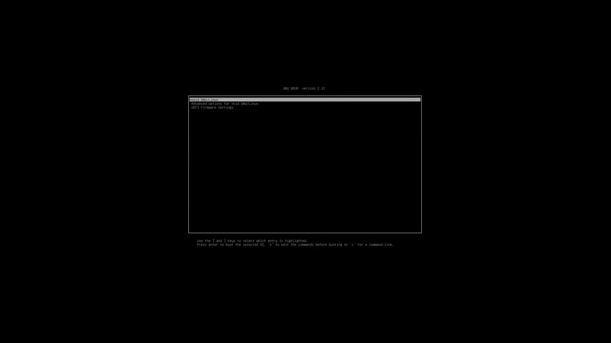
</p>

>Agora terá a tela de login via linha de comando pois não instalamos nenhuma interface de bloqueio, mas iremos instalar ainda ela, porém por agora vamos ficar sem mesmo, para fazer login:

```
Login: o nome de usuario que você configurou, no meu caso ramon
Senha: a senha que você configurou para esse usuário
```

>após fazer login na sua conta, estamos prontos para inicializar nossa sessão x, execute:

```
[ramon@voidlinux] # echo ´exec i3´ >> .xinitrc
[ramon@voidlinux] # startx
```

**💻✨ Configuração do i3**

>Quando inicia o i3 sem o arquivo de configuração, ele solicita que voce gere um:

<p align="center">
  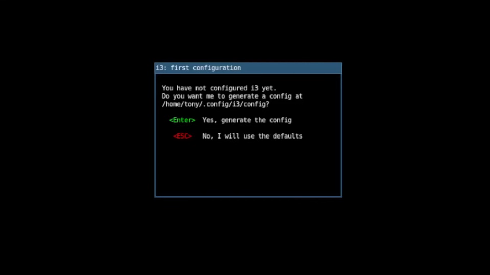
</p>

>Pressione 'ENTER'

<p align="center">
  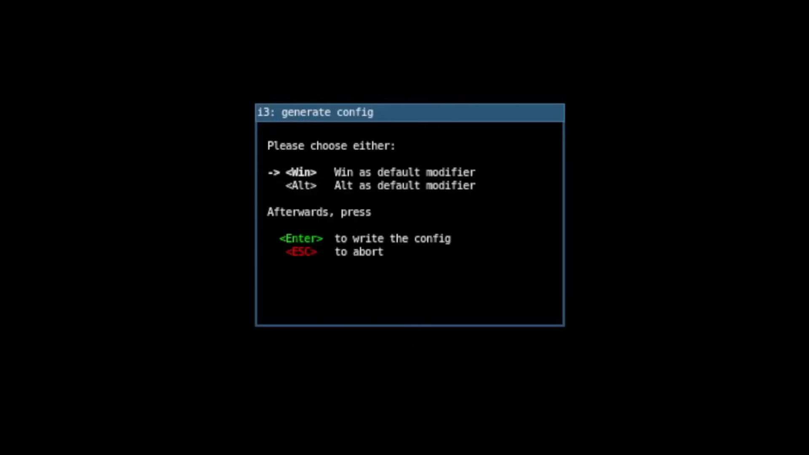
</p>

>Esse pergunta se queres usar a tela WIN ou ALT como telca super, eu gosto da tecla WIN então dou 'ENTER', mas se você preferir o ALT basta usar a seta para cima ou para baixa para escolher sua preferência e dar 'ENTER'

<p align="center">
  
</p>

>E pronto sua configuração esta escrita, agora precisamos instalar o inicializador de aplicativos e usaremos o dmenu, porque ele é o padrão usado no i3, para instala-lo, pressione a tecla SUPER+ENTER, para abrir o terminal e digite: 

```
[ramon@voidlinux ~]$ sudo xbps-install dmenu
```

>Agora vamos testar ele, abra um novo espaço de trabalho apertando SUPER+2, aperte SUPER+D após apertar esse atalho ele deve abrir o menu

<p align="center">
  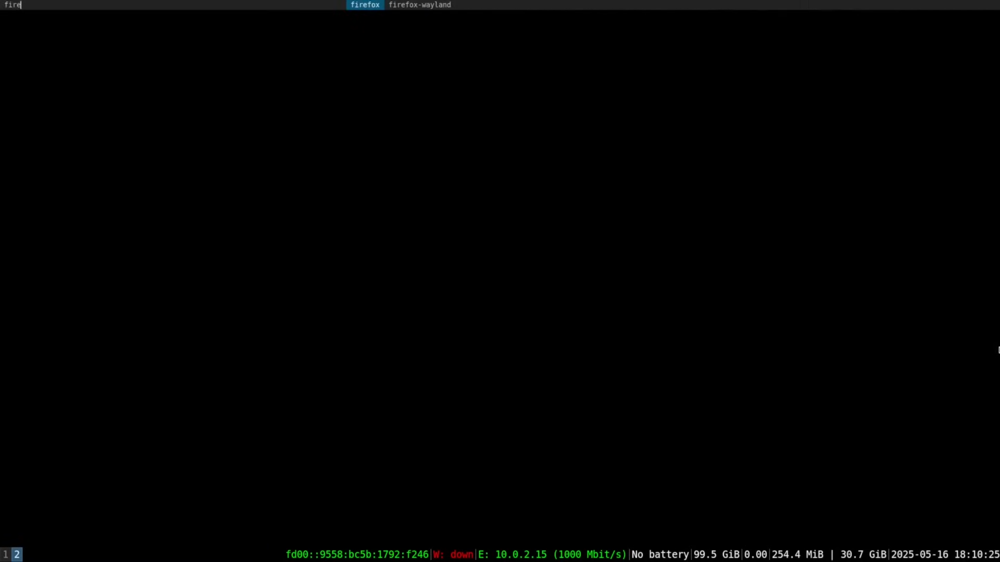
</p>

>Agora você pode pesquisar todos seu aplicativos e abrir ele

## ✅ E pronto, a instalação está completa!

Todas as informações apresentadas aqui foram baseadas na wiki oficial do Void Linux, adaptadas e organizadas para deixar o processo mais intuitivo e direto.
A partir deste ponto, você já tem o Void Linux instalado e funcional.

Na próxima sessão — “Pós-instalação” — irei mostrar o que fazer depois da instalação: como configurar o áudio, aplicar personalizações, realizar adaptações e deixar o sistema pronto para uso no dia a dia.

---
ㅤ
ㅤ

## 🪄 Pós-instalação
Essa etapa garante que o sistema esteja funcional e pronto para o uso do dia a dia.

Durante a instalação (com `chroot`), já havíamos instalado:
- `i3`
- `i3status`
- `dmenu`

Agora, vamos adicionar outras ferramentas importantes para o ambiente gráfico e o uso diário.

---

### 📦 Pacotes que serão instalados

- `i3lock`  
- `NetworkManager`, `network-manager-applet`  
- `xdg-user-dirs`  
- `gvim`, `nano`  
- `nerd-fonts`  
- `xterm`  
- `geeqie`  
- `volumeicon`  
- `xfce4-clipman-plugin`  
- `mc`  
- `Thunar`  
- `scrot`  
- `ImageMagick`  
- `unzip`, `zip`  
- `xorg-fonts`, `dejavu-fonts-ttf`  
- `lxappearance`  
- `wget`, `axel`  
- `curl`  
- `gnome-themes-standard` *(pode aparecer como `gnome-themes-extra` em algumas versões)*  
- `pasystray`  
- `mps-youtube`, `youtube-dl`, `mpv` *(podendo ser substituídos por `yt-dlp` caso necessário)*  
- `xarchiver`  
- `cava`  
- `mate-themes`  
- `lightdm`, `lightdm-gtk3-greeter`  
- `nitrogen`

---

### ⚙️ Observação

Mesmo com seu usuário já configurado, **reinicie o sistema** e, no login, entre novamente como **root** (sem o pendrive live).  
O sistema já rodará diretamente pelo SSD, permitindo configurar e instalar tudo de forma definitiva.
Caso nao se lembre do login e senha, volte ao começo deste tutorial que é o mesmo.
ㅤ

---
ㅤ
### 📥 Instalação dos pacotes

Para baixar todos os pacotes listados acima, execute:

```bash
[root@void ~]# xbps-install -S i3lock NetworkManager network-manager-applet xdg-user-dirs gvim nano nerd-fonts xterm geeqie volumeicon xfce4-clipman-plugin mc Thunar scrot ImageMagick unzip zip xorg-fonts dejavu-fonts-ttf lxappearance wget axel curl gnome-themes-standard pasystray mps-youtube youtube-dl mpv xarchiver cava mate-themes lightdm lightdm-gtk3-greeter nitrogen
```

Após instalar todos os pacotes, executamos alguns comandos essenciais para **habilitar os serviços do sistema** e **iniciar o ambiente gráfico** corretamente.

```
[root@void ~]# ln -sf /etc/sv/dbus /var/service
```
>🔧 Cria um link simbólico do serviço dbus para a pasta /var/service, que é onde o runit (sistema de inicialização do Void Linux) gerencia os serviços ativos.
O dbus é fundamental para a comunicação entre processos e aplicações gráficas — sem ele, vários componentes do ambiente desktop não funcionariam.

```
[root@void ~]# ln -sf /etc/sv/lightdm /var/service
```
>💡 Faz o mesmo procedimento, mas para o LightDM, o gerenciador de login gráfico.
Com esse link criado, o runit passará a iniciar o LightDM automaticamente toda vez que o sistema for ligado.

agora pode reiniciar novamente o sistema e se tudo der certo ja vai iniciar com o lightdm, reinicie com:

```
[root@void ~]# shutdown -r now
```
>🔁 Reinicia o sistema imediatamente para aplicar todas as mudanças.
Após a reinicialização, o LightDM será iniciado, permitindo que você entre com seu usuário através de uma interface gráfica.

após reiniciado, faça o seu login... após aperto o i3wm, aperte as teclas **`SUPER`+`ENTER`**, para abrir o terminal e rode o seguinte comando:

```
[ramon@voidlinux ~]$ ls -a
```
>📂 O comando ls -a lista todos os arquivos e diretórios do seu diretório atual, incluindo os arquivos ocultos (que começam com .).
É útil para verificar se as configurações do i3wm e outros arquivos de inicialização foram criados corretamente.


agora digite:

```
[ramon@voidlinux ~]$ su
```
>Digite sua senha, isso serve para ir para o root do usuário

agora vamos **ativar o NetworkManager** e ajustar o **layout do teclado** para o padrão brasileiro (ABNT2).

```
[root@voidlinux ramon]# ln -s /etc/sv/NetworkManager /var/service
[root@voidlinux ramon]# mkdir -p /etc/X11/xorg.conf.d
```
>🌐 Cria um link simbólico do serviço NetworkManager em /var/service.
Isso faz com que o runit (o sistema de inicialização do Void) inicie automaticamente o NetworkManager em cada boot, permitindo o gerenciamento fácil de conexões Wi-Fi e cabeadas.
Sem esse passo, o Void não gerencia redes por padrão após a reinicialização.

```
[root@voidlinux ramon]# vim /etc/X11/xorg.conf.d/00-keyboard.conf
```
>🗂️ Cria o diretório onde ficam os arquivos de configuração do servidor gráfico Xorg.
A flag -p garante que, caso os diretórios intermediários não existam, eles serão criados também.
Vamos usar esse local para definir o layout do teclado do sistema gráfico.

dentro do vim desse diretorio, digite: 

```
Section "InputClass"
  Identifier "system-keyboard"
  MatchIsKeyboard "on"
  Option "XkbLayout" "br"
  Option "XkbVariant" "abnt2"
EndSection
```
para salvar e sair aperte **`ESC`** e digite **`:wq`**

>🇧🇷 Essas opções definem:
XkbLayout "br" → Layout do teclado brasileiro
XkbVariant "abnt2" → Variante ABNT2, com “ç” e teclas acentuadas

agora de um **`reboot`** pelo terminal para reiniciar as configurações

após reiniciado abra novamente o terminal com: **`SUPER`+`ENTER`**
ㅤ
ㅤ
## 🧰 Drivers e Hardware
Tutoriais para configurar:
- Drivers de vídeo **NVIDIA / AMD / Intel**  
- Áudio (**PipeWire**, **ALSA**)  
- Bluetooth  
- Touchpad e periféricos  

Cada parte será explicada em detalhes, com foco na **compatibilidade e estabilidade** do sistema.
ㅤ
ㅤ

---
ㅤ
ㅤ
## 🎨 Ambientes gráficos
Este guia será voltado especialmente para o **i3wm**, um *tiling window manager* conhecido por sua leveza e produtividade.  
Vamos aprender a:
- Instalar e configurar o i3wm  
- Personalizar atalhos, barras e temas  
- Integrar ferramentas como `rofi`, `polybar` e `picom`  
- Melhorar a experiência visual e funcional do sistema  

> 🧱 O objetivo é mostrar como o i3wm pode ser uma alternativa poderosa e minimalista aos ambientes gráficos tradicionais.
>
ㅤ
ㅤ

---

## 🧰 Ferramentas essenciais
Uma seleção de ferramentas úteis para o dia a dia:
- **neovim** — editor de texto avançado  
- **git** — controle de versão  
- **htop / btop** — monitoramento do sistema  
- **ranger** — gerenciador de arquivos em terminal  
- **firefox / brave** — navegação web  

Cada ferramenta será explicada com sua função e motivo de uso no Void Linux.

---

## 🧠 Dicas e truques
Pequenos ajustes que fazem grande diferença:
- Alias úteis no `.bashrc` ou `.zshrc`  
- Temas e fontes personalizadas  
- Otimização de desempenho  
- Scripts automáticos com `RunIt`  

---

## 🧩 Solução de problemas
Resolução de erros comuns:
- Falhas de boot  
- Wi-Fi não detectado  
- Sem áudio ou microfone  
- Tela preta no i3wm  

> 🧰 Cada erro documentado virá com a causa e a solução testada.

---

## 🤝 Contribuindo
Contribuições são bem-vindas!  
Se você quiser ajudar a melhorar este guia:
1. Faça um **fork** do repositório  
2. Crie uma **branch** com suas alterações  
3. Envie um **pull request** explicando suas modificações  

---

## 📜 Licença
Este projeto é licenciado sob a [MIT License](LICENSE).

---

> 🧭 *Feito com dedicação e curiosidade — por alguém que acredita no poder do aprendizado através da prática.*
